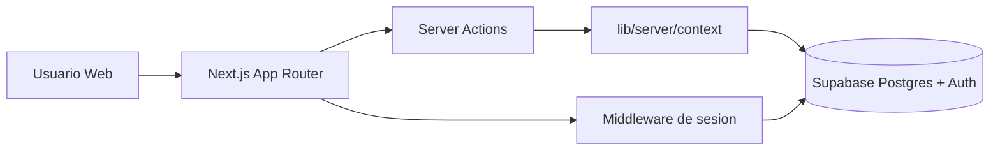

# Arquitectura

## Objetivo

CashFlow es una aplicacion web para gestion financiera personal y empresarial, basada en:

- Frontend y BFF: Next.js 14 (App Router + Server Actions)
- Datos y Auth: Supabase (Postgres + Auth + RLS)
- UI: React + Tailwind

## Vista de alto nivel

## Capas y responsabilidades

### 1) Capa de presentacion (`app/`, `components/`)

- Rutas App Router:
  - Publicas: `/`, `/login`, `/register`
  - Protegidas: `/onboarding/*`, `/dashboard/*`
- Componentes UI y componentes de dominio (ejemplo: transacciones).
- No debe contener reglas de negocio complejas de persistencia.

### 2) Capa de acciones server (`app/actions/`)

- Endpoint interno de mutaciones/lecturas desde componentes server/client.
- Orquesta validaciones y revalidaciones (`revalidatePath`).
- Debe delegar contexto de seguridad a `lib/server/context`.

### 3) Capa de dominio server (`lib/server/`)

- `context.ts`: resuelve `user` y `orgId` de forma consistente.
- `onboarding.ts`: encapsula onboarding atomico via RPC.
- Aqui vive la logica reusable del backend de aplicacion.

### 4) Capa de datos y seguridad (Supabase)

- Esquema SQL en `supabase/migrations`.
- RLS activa por tenant en tablas con `org_id`.
- Integridad tenant-safe reforzada con FK compuestas `(org_id, entity_id)`.

## Flujos criticos

## Auth y guardas de ruta

1. Middleware (`middleware.ts` + `lib/supabase/middleware.ts`) refresca sesion.
2. Si usuario anonimo entra a `/dashboard` o `/onboarding`, redirecciona a `/login`.
3. Si usuario autenticado entra a `/login` o `/register`, redirecciona a `/dashboard`.

## Onboarding atomico

1. UI en `/onboarding/select-profile`.
2. Action `createProfileOrganization` llama servicio `createOrganizationWithOnboarding`.
3. Servicio ejecuta RPC `create_org_with_onboarding(...)`.
4. La funcion SQL crea organizacion, membership, onboarding_state y seeds en una transaccion unica.

## Transacciones

1. `getTransactions` aplica sanitizacion de sort/paginacion y filtro por `org_id`.
2. `createTransaction` valida schema, inserta con `org_id` y `created_by`.
3. `updateTransaction` y `deleteTransaction` operan por `id + org_id`, validan `count > 0`.
4. Import/Export CSV viven en `app/api/transactions/*` con validacion, rate-limit y logging estructurado.

## Modulos implementados y en progreso

- Implementados:
  - Dashboard (KPIs y transacciones recientes)
  - Transacciones (listado + filtros + alta + edicion + eliminacion + import/export CSV)
  - Cuentas (lectura + alta)
  - Categorias (lectura + alta)
  - Presupuesto (overview + set budget)
  - Forecast (supuestos mensuales)
  - Settings (configuracion organizacional)

## Principios de escalabilidad aplicados

- Aislamiento multi-tenant en todas las consultas criticas.
- Seguridad en DB con RLS y constraints, no solo en UI.
- Logica de negocio compartida en capa `lib/server/*`.
- Observabilidad en servidor con `lib/server/logger.ts` + Sentry opcional.
- Endurecimiento web con security headers en `next.config.mjs`.
- Test strategy en tres niveles: unit, integration, e2e.
