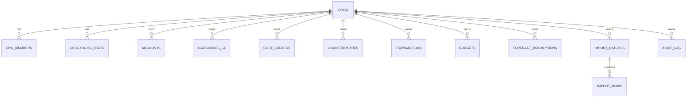

# Modelo de Datos

## Tipos base

- `org_type`: `personal | business`
- `member_role`: `owner | admin | member | viewer`
- `account_type`: `cash | bank | credit_card | loan | investment`
- `counterparty_type`: `customer | vendor | other`

## Entidades principales

## Tenant y acceso

- `orgs`: organizacion financiera (unidad de tenant).
- `org_members`: relacion usuario-organizacion con rol.
- `onboarding_state`: estado del onboarding por usuario y organizacion.

## Maestro financiero

- `accounts`: cuentas financieras por tenant.
- `categories_gl`: categorias contables por tenant.
- `cost_centers`: centros de costo (principalmente perfil business).
- `counterparties`: terceros (cliente/proveedor/otros).

## Movimientos y planeamiento

- `transactions`: libro de movimientos.
- `budgets`: presupuesto mensual por categoria.
- `forecast_assumptions`: supuestos de proyeccion mensual.

## Importaciones y auditoria

- `import_batches`: lote de importacion.
- `import_rows`: filas procesadas de un lote.
- `audit_log`: eventos de auditoria por entidad.

## Relaciones criticas

## Integridad multi-tenant (estado actual)

Desde la migracion `007_multitenant_integrity_and_onboarding.sql`:

- Se crean indices unicos por `(org_id, id)` en:
  - `accounts`
  - `categories_gl`
  - `cost_centers`
  - `counterparties`
- Se reemplazan FK de `transactions` y `budgets` para que validen por tenant:
  - `transactions (org_id, account_id) -> accounts (org_id, id)`
  - `transactions (org_id, category_gl_id) -> categories_gl (org_id, id)`
  - `transactions (org_id, counterparty_id) -> counterparties (org_id, id)`
  - `transactions (org_id, cost_center_id) -> cost_centers (org_id, id)`
  - `budgets (org_id, category_gl_id) -> categories_gl (org_id, id)`
  - `budgets (org_id, cost_center_id) -> cost_centers (org_id, id)`

## Politicas de seguridad

`005_rls_policies.sql` habilita RLS y define politicas por membresia/rol:

- Lectura: miembros del tenant.
- Escritura: segun `can_write_org` o `is_org_admin`.
- Restricciones especiales:
  - `transactions_insert` exige `created_by = auth.uid()`.
  - `transactions_delete` requiere rol admin/owner.

## Invariantes de dominio

- Un usuario puede pertenecer a multiples organizaciones.
- Toda data de negocio debe quedar asociada a un `org_id`.
- No debe ser posible enlazar entidades de un tenant distinto.
- Onboarding debe crear estado minimo consistente:
  - org
  - membership owner
  - onboarding_state
  - categorias seed (y cost centers para business)
